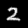
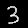

# ml-handwriting-recognition
A handwriting recognition project with CNN structure (LeNet).

By default, it uses MNIST dataset to train. The trained model is saved in the ./saved_model directory by default.

To use the model, use the use_model.py file, it by default recognize the images saved in the ./imgs directory, 
and generate output to the file ./output.txt with the format "img_path -> number \n"

As an example:

gives output:

./imgs/1.png -> 1
 
./imgs/2.png -> 2
 
./imgs/3.png -> 3